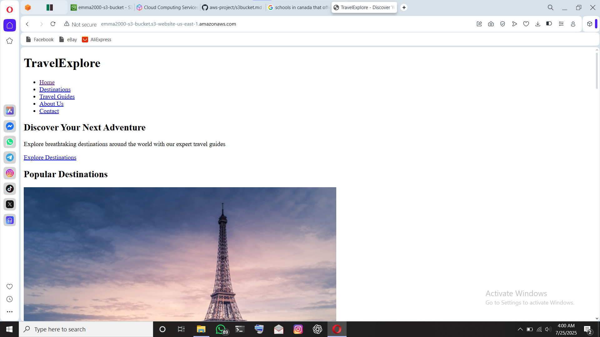
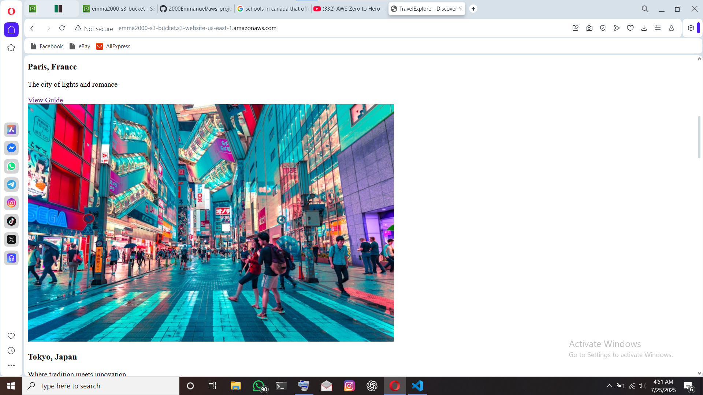
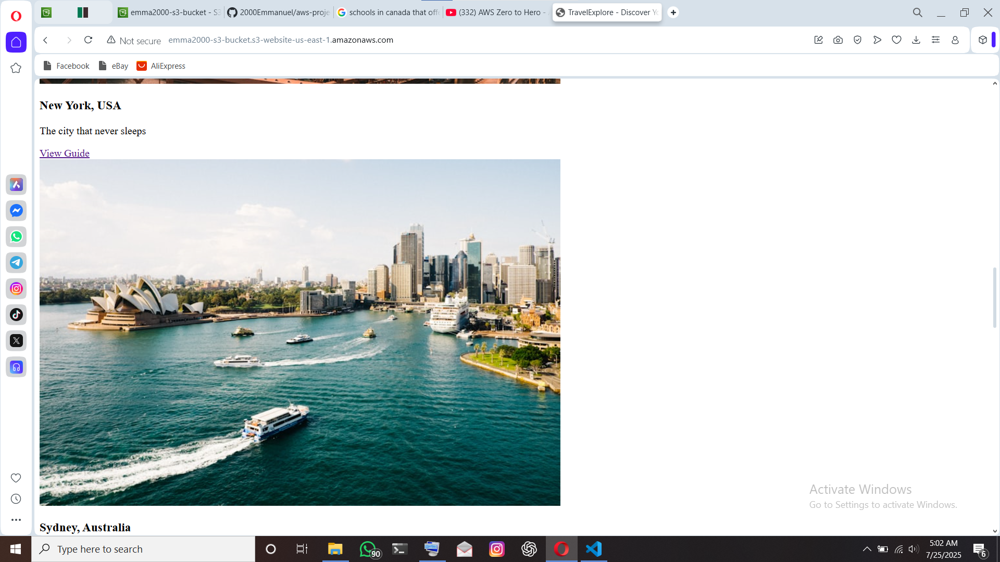

✅ Step-by-Step: How to Create an S3 Bucket and a static website on AWS
- Step 1: Sign in to AWS
Go to: https://console.aws.amazon.com/

 - Step 1 Log in to your AWS account

-  Step 2: Open the S3 Service
In the AWS Management Console, type S3 in the search bar and select S3 from the results.

-  Step 3: Click “Create bucket”
On the S3 dashboard, click the “Create bucket” button.

-  Step 4: Configure your bucket
Fill out the form with the following:

- Bucket name: Must be globally unique (e.g. my-first-s3-bucket-2025)

- Region: Choose the region closest to your users or services (e.g. US East (N. Virginia))

-  Tip: Once created, the region cannot be changed.

- Step 5: Set Bucket Options (for now, you can leave most default)
Block all public access: Leave enabled for security, unless you're hosting a public website.

- Versioning: You can enable it to keep multiple versions of your files.

- Encryption: Optional. AWS can automatically encrypt your data.

 - Step 6: Create the bucket Click “Create bucket” at the bottom of the page.

  - Done! You've just created your S3 bucket.
   
        HOW TO CREATE A STATIC WEBSITE IN AN S3 BUCKET
    - After creating your s3 bucket, enter into the bucket and go to permissions.
    - Then choose enable a static website, and then input index.html and error.html on the spaces provided.
    - Then in permissions click on edit bucket policy and then policy generator.
    - On type of Policy choose S3 bucket policy.
    - Choose allow on effect, use asterisk on principal.
    On actions choose getObject.
    Then on the Amazon resource name{ARN} put in the ARN.: arn:aws:s3:::{BucketName}* then generate policy. 
    - Then upload your folders and files. N:B your index.html and error.html must be in the root file in your bucket, they should not be in any folder or it would not work.

Thats it for now