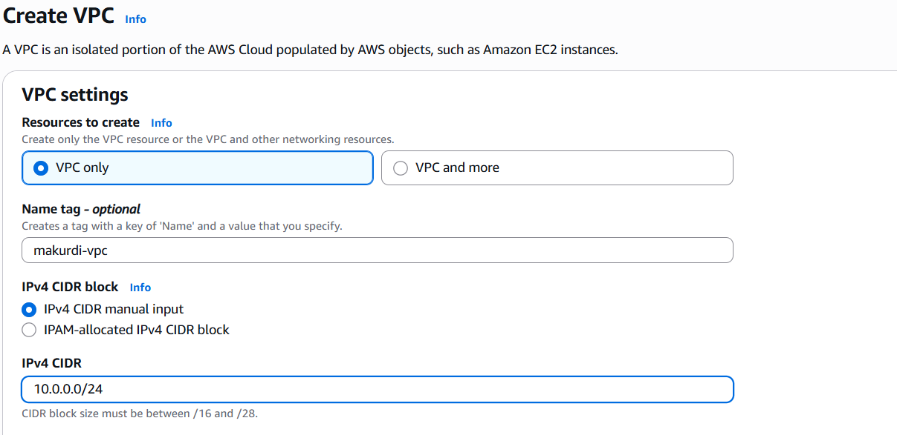
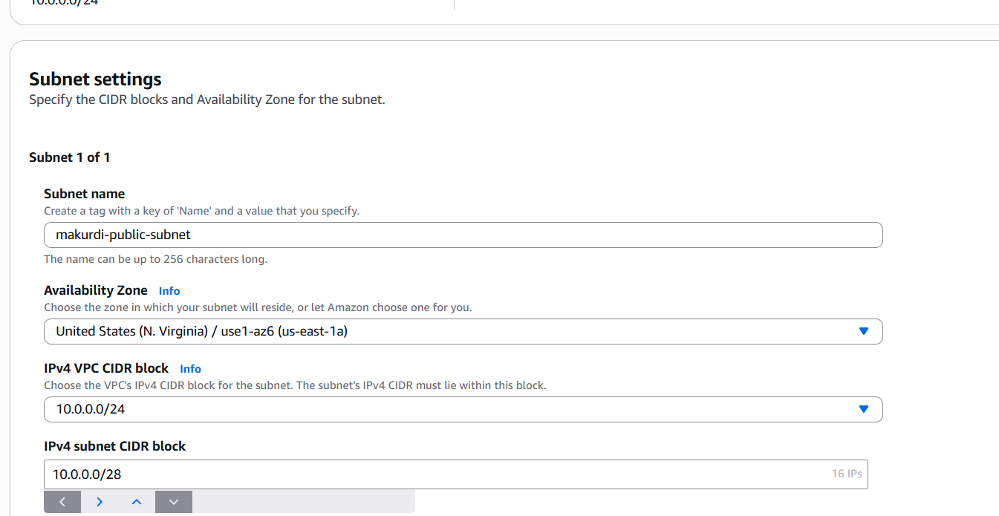
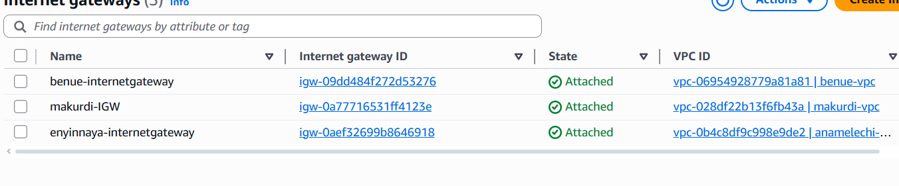
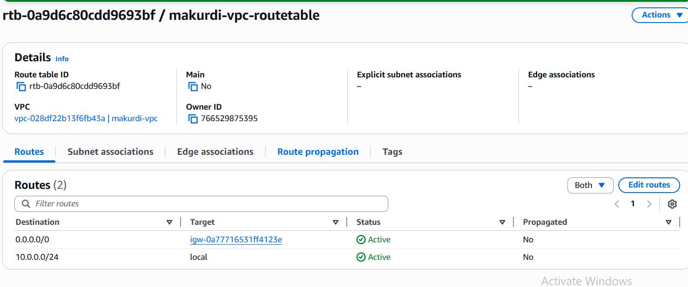
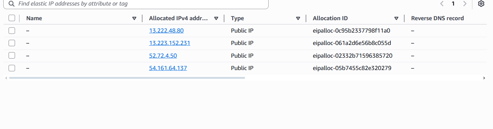
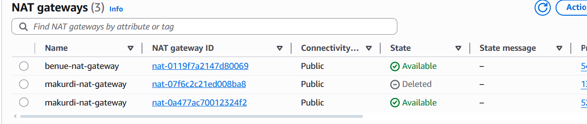

HOW TO CREATE A SINGLE TIER VPC : 1 VPC, 1 AVAILABILITY ZONE, 2 SUBNETS, 3 ROUTE TABLES, 1NAT, 1 INTERNET GATEWAY, 2 SECURITY GROUPS...

- FIRSTLY CREATE A VPC
-
-   
-   
- THEN CREATE TWO SUBNETS(ONE EACH FOR PUBLIC AND PRIVATE)
-
- 
- 
- THEN CREATE AN INTERNET GATEWAY FOR THE VPC AND THEN ATTACH IT TO MY VPC.
-
-   
-   
- CREATE 3 ROUTE TABLES(ONE EACH FOR VPC,PUBLIC AND PRIVATE) .THEN ON THE VPC RT EDIT ROUTES, ADD ROUTE AND CHOOSE ANYWHWERE (0.0.0.0./0). TARGET SHOULD BE IGW. CLICK ON SUBNET ASSOCIATIONS AND ASSOCIATE IT WITH ONLY THE PUBLIC SUBNET. ON THE THE PUBLIC RT, EDIT RT TRAFFIC FROM ANYEHERE, TARGET IGW AND THE NAT GATEWAY. USE THE IP OF YOUR PUBLIC SUBNET. NB:YOU CAN DO THIS AFTER CREATING YOUR NAT GATEWAY AND ALLOCATING THE ELASTIC IP ADDRESS. ON THE SUBNET ASSOCIATIONS CHOOSE ONLY TO PUBLIC. FOR THE PRIVATE RT, ON THE SUBNET ASSOCIATION CHOOSE ONLY TO PRIVATE.
-
-   
-   
- ON THE ELASTIC IP ADDRESS, JUST CREATE AND ALLOCATE AN IP ADDRESS.
-
-   
-   
- FOR THE NAT GATEWAY, SELECT A SUBNET WHICH SHOULD BE A PUBLIC SUBNET. CONNECTIVITY TYPE SHOULD BE PUBLIC. THEN ADD THE ELASTIC IP YOU ALLOCATED EXACTLY.
-
- 
- 
- ON THE SECURITY GROUPS, YOU ARE CREATING TWO(FOR PUBLIC AND PRIVATE) . FOR THE PUBLIC SG ON DESCRIPTION , WRITE ALLOW SSH . FOR THE INBOUND RULES ALLOW : SSH, HTTP AND HTTPS , SOURCE SHOULD BE ANYWHERE. FOR THE PRIVATE SG, FOLLOW THE SAME STEP , THEN ON RHE INBOUND RULE ALLOW SSH , THE ON THE SEARCH SPACE LOOK FOR THAT SECURITY FOR YOUR PUBLIC SG AND CHOOSE IT. 
- THEN CREATE TWO INSTANCES(PUBLIC AND PRIVATE) . FOR THE PUBLIC INSTANCE , FOLLOW EVERY STEP UNTILL NETWORK SETTINGS THEN EDIT, SELECT YOUR VPC ANFD THEN YOUR SUBNET , CHOOSE PUBLIC SUBNET FOR PUBLIC INSTANCE AND PRIVATE SUBNET FOR PRIVATE INSTANCE . ENABLE AUTO-ASSIGN PUBLIC IP FOR PUBLIC INSTANCE AND DISABLE IT FOR PRIVATE INSTANCE. THEN CHOOSE EXISTING SECURITY GROUPS AND CHOOSE PUBLIC FOR PUBLIC AND PRIVATE FOR PRIVATE INSTANCE.
- THEN ON YOUR LINUX TERMINAL DO THE SSH COMMAND USING YOUR PUBLIC IP ADDRESS AND YOUR KEY . PEM . TO DO SSH = ssh -i (key.pem) (hostname)@(instance public ip address)
- 
-  
  
- TO SSH TO YOUR PRIVATE INSTANCE , FIRST COPY YOUR KEY.PEM TO YOUR PUBLIC EC2 INSTANCE TO DO THAT DO THIS COMMAND
- ```scp -i key.pem ~/the pem file you want to copy hostname@public ip address of your public instance:~```
-  NB: DO THIS COMMAND OUTSIDE YOUR INSTANCE ON THE FOLDER YOUR KEY.PEM IS LOCATED.
- TO SSH TO YOUR PRIVATE INSTANCE , DO THIS COMMAND FROM INSIDE YOUR PUBLIC EC2 NSTANCE ```ssh -i key.pem hostname@private-ip-number of-private-instance```
